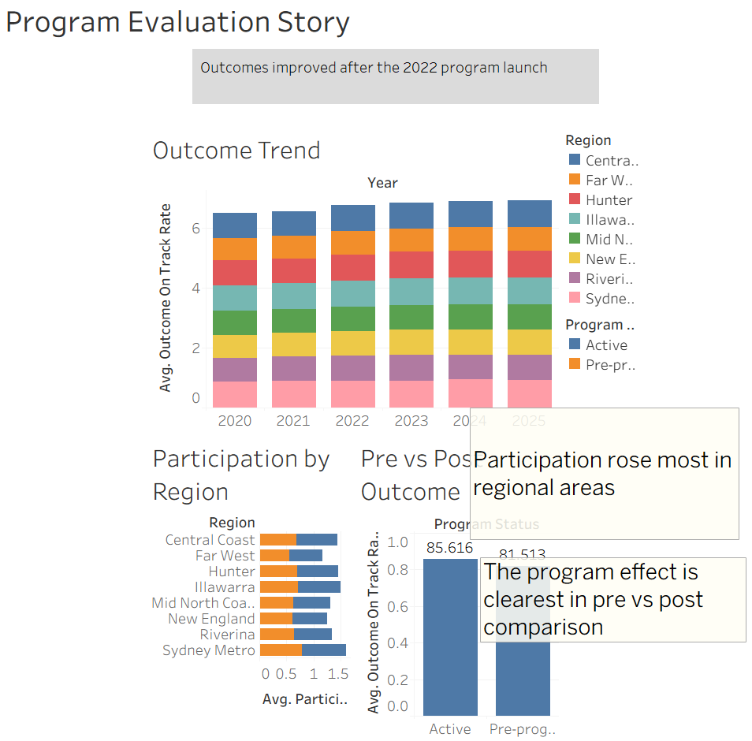
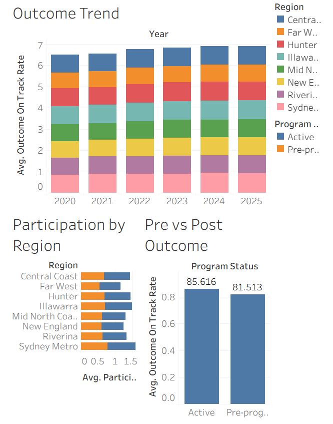

# Program Performance & Outcome Evaluation Dashboard (Tableau)

An interactive Tableau dashboard and story evaluating a NSW early-childhood
**program** across regions and years — built to answer the core evaluation
question: *did the program improve participation and child outcomes, where, and
for whom?*

### ▶ Live interactive dashboard
**[View it on Tableau Public →](https://public.tableau.com/app/profile/mohammad.zeeshan5470/viz/TB4_Program_Evaluation/ProgramEvaluationStory)**

> **Tooling:** Tableau Public · calculated fields · dashboard actions
> (click-to-filter) · story points · executive presentation flow.

---

## Dashboard preview

### Program Evaluation Story


### Program Evaluation Dashboard


---

## The evaluation question

A government early-childhood program was rolled out across NSW regions from
2022. Before and after that point, the dashboard tracks participation, spend per
child, service quality, and the key outcome — the share of children
developmentally **on track** at school entry — by region and year.

**Key questions answered**
- Did child outcomes improve after the program launched in 2022?
- Did participation rise, and was the lift larger in some regions than others?
- How do "pre-program" years compare with "active" years (a before/after read)?
- Which regions are leading or lagging, to target further investment?

**Stakeholders:** program owners, evaluation and policy teams, regional
directors, and executive/finance for continued-funding decisions.

---

## Approach

- **Trend analysis** — average outcome rate by year, by region, to see the
  post-2022 step-up.
- **Before/after comparison** — outcomes and participation grouped by
  `ProgramStatus` (Pre-program vs Active) as a simple program-effect read.
- **Regional segmentation** — participation by region, split by program status.
- **Interactivity** — clicking a region filters the whole dashboard
  (a Tableau dashboard action).
- **Narrative** — a Tableau **Story** walks an executive through the finding
  step by step.

---

## Key findings (illustrative data)

- State-average outcomes rose from ~81% (2020–21, pre-program) to ~86% (2025)
  — a clear step-up after the 2022 launch.
- Participation was higher in active years than pre-program years across regions.
- Regional areas (e.g. Far West, New England) started lowest and show the most
  room for targeted investment.

**Recommendation:** continue and expand the program, prioritising the
lowest-performing regions where the participation and outcome gap is widest, and
keep monitoring the before/after trend as further years of data arrive.

---

## Calculated field

```
Outcome Pct = ROUND([OutcomeOnTrackRate] * 100, 1)
```
(used as a clean 0–100 label on the charts)

---

## How to open / reproduce

- **View live (no install):** use the Tableau Public link above.
- **Open the workbook:** download `TB4_Program_Evaluation.twbx` and open it in
  Tableau Public / Tableau Desktop (free).
- **Data:** `data/program_evaluation.csv` (one row per Region × Year).

---

## About the data

Simulated, illustrative only. The structure mirrors **Report on Government
Services (RoGS)**-style performance reporting (participation, expenditure,
quality and outcome by region and year), so the same evaluation approach
transfers to real RoGS / ABS / data.NSW data. **Numbers are not official
statistics.**

Real source (for the live version):
- Report on Government Services — Early Childhood Education and Care (Section 3):
  <https://www.pc.gov.au/ongoing/report-on-government-services/child-care-education-and-training/early-childhood-education-and-care>

---

## Repository structure

```
tb4-program-evaluation-dashboard/
├── README.md
├── TB4_Program_Evaluation.twbx
├── generate_data.py
├── data/
│   └── program_evaluation.csv
└── images/
    ├── 01_story.png
    └── 02_dashboard.png
```

---

## Tools & techniques

Tableau Public · calculated fields · dashboard actions (click-to-filter) ·
story points · trend analysis · before/after program evaluation · regional
segmentation · executive presentation flow.
