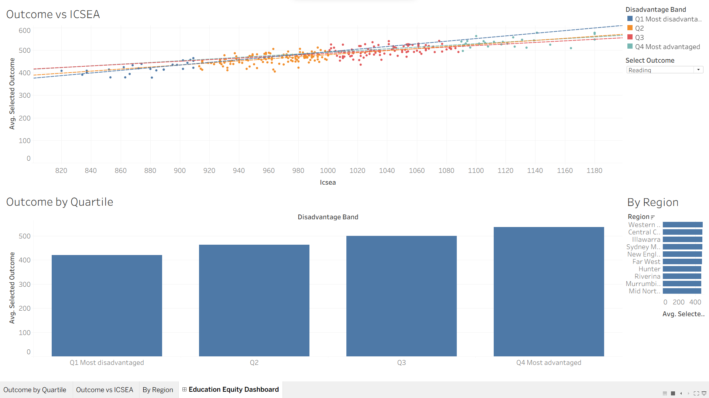
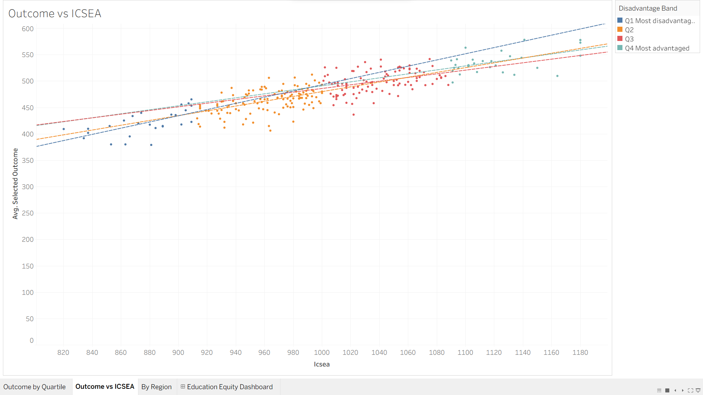

# Educational Outcomes & Disadvantage Equity Explorer (Tableau)

An interactive Tableau dashboard exploring how NSW school **outcomes** (NAPLAN-style
reading/numeracy and attendance) vary with **socio-educational disadvantage**
(ICSEA / SEIFA), letting a user switch the measure and filter the cohort to
explore the equity gap themselves.

### ▶ Live interactive dashboard
**[View it on Tableau Public →](https://public.tableau.com/app/profile/mohammad.zeeshan5470/viz/TB2_Education_Equity/EducationEquityDashboard?publish=yes)**

> **Tooling:** Tableau Public · **parameter control** (switch outcome measure) ·
> calculated fields · dashboard actions · interactive filtering.

---

## Dashboard preview

### Equity Explorer Dashboard


### Outcome vs Disadvantage


---

## The problem

Educational outcomes track socio-economic disadvantage closely, but a single
average hides the gradient. This dashboard lets a policy user **choose an outcome
measure** (reading, numeracy or attendance) and instantly see how it varies
across disadvantage quartiles, regions and sectors — making the equity gap
visible and explorable rather than buried in a table.

**Key questions answered**
- How large is the outcome gap between the most and least disadvantaged schools?
- Does the gap differ by outcome (reading vs numeracy vs attendance)?
- How does the relationship between advantage (ICSEA) and outcomes look as a gradient?
- Which regions or sectors over- or under-perform relative to their advantage level?

**Stakeholders:** education policy and equity teams, regional directors, and
executives prioritising equity-targeted programs.

---

## Approach

- **Parameter control** — a `Select Outcome` parameter lets the user switch the
  measure shown across the whole dashboard (reading / numeracy / attendance).
- **Equity scatter** — outcome vs ICSEA with a trend line; the slope is the
  equity gradient.
- **Quartile comparison** — average outcome by SEIFA disadvantage band.
- **Interactivity** — filters on Region and Sector; click-to-filter actions.

---

## Calculated field (the parameter switch)

A parameter `Select Outcome` (string list: `Reading`, `Numeracy`, `Attendance`)
drives a calculated field:

```
Selected Outcome =
CASE [Select Outcome]
  WHEN "Reading"    THEN [ReadingScore]
  WHEN "Numeracy"   THEN [NumeracyScore]
  WHEN "Attendance" THEN [AttendanceRate]
END
```

This single field is placed on the charts, so changing the parameter re-draws
every view.

---

## Key findings (illustrative data)

- A steep gradient: mean reading rises from ~420 in the most disadvantaged
  quartile to ~537 in the most advantaged — a ~116-point gap.
- The gap is present across reading and numeracy; attendance shows a smaller but
  consistent gradient.
- Some regions/sectors out-perform their advantage level, suggesting good
  practice worth examining.

**Recommendation:** target literacy/numeracy support at the lowest-advantage
quartile, and study the positive-outlier schools (out-performing their ICSEA) to
identify transferable practice.

---

## How to open / reproduce

- **View live (no install):** Tableau Public link above.
- **Open the workbook:** download `TB2_Education_Equity.twbx` and open in Tableau.
- **Data:** `data/education_equity.csv` (one row per school).

---

## About the data

Simulated, illustrative only. Structure mirrors **ACARA / My School**-style data
(school ICSEA, NAPLAN-style scores, attendance) joined to **SEIFA** quartiles, so
the method transfers to real published school data. **Numbers are not official
statistics.**

Real sources (for the live version):
- ACARA / My School: <https://www.myschool.edu.au>
- ABS SEIFA 2021: <https://www.abs.gov.au/statistics/people/people-and-communities/socio-economic-indexes-areas-seifa-australia/latest-release>

---

## Repository structure

```
tb2-education-equity-explorer/
├── README.md
├── TB2_Education_Equity.twbx
├── data/
│   └── education_equity.csv
└── images/
    ├── 01_dashboard.png
    └── 02_outcome_vs_disadvantage.png
```

---

## Tools & techniques

Tableau Public · parameters · calculated fields (CASE) · trend lines · equity
gradient analysis · dashboard actions · interactive filtering.
